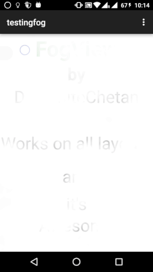
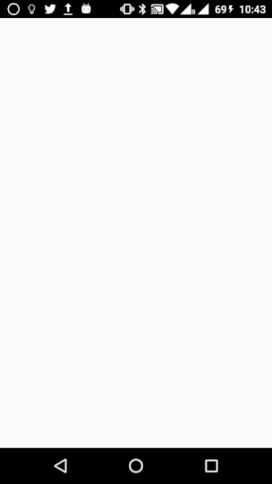

# Fog View Android Library
[](http://android-arsenal.com/details/1/3833)
[](http://www.apache.org/licenses/LICENSE-2.0.html)
[](https://github.com/dynamitechetan/FogView_Library)
#### Min SDK 8 (Android 2.2–2.2.3 Froyo)
## Screnshots

    


## How to use

If you want use this library, you can download project and import it into your workspace and add the project as a library in your android project settings.

Or you can use the gradle dependency, you have to add these lines in your build.gradle file:
# Method 1
```xml
repositories {
        jcenter()
}

dependencies {
    compile 'com.dynamitechetan.fogviewlibrary:FogViewLibrary:1.0.0'
    
}
```
If the above code didn't worked try using Method 2
# Method 2
```xml
repositories {
	maven {
            url 'https://dl.bintray.com/dynamitechetan/maven'
        }
}

dependencies {
    compile 'com.dynamitechetan.fogviewlibrary:FogViewLibrary:1.0.0@aar'
    
}
```
# or Using Maven:
```xml
<dependency>
<groupId>com.dynamitechetan.fogviewlibrary</groupId>
<artifactId>FogViewLibrary</artifactId>
<version>1.0.0</version>
<type>pom</type> 
</dependency>
```


## BASIC USAGE
```xml
 <com.dynamitechetan.fogviewlibrary.FogView
        android:id="@+id/RubFog"
        android:layout_width="match_parent"
        android:layout_height="match_parent"
  />
```

The FogView have some custom attributes, to use them , you must add this line in your xml file in the first component:

```xml
<RelativeLayout xmlns:android="http://schemas.android.com/apk/res/android"
    xmlns:fog="http://schemas.android.com/apk/res-auto"
    android:layout_width="match_parent"
    android:layout_height="match_parent"
    >
</RelativeLayout>
```

## USING A CUSTOM FOG IMAGE

```xml
 <com.dynamitechetan.fogviewlibrary.FogView
        android:id="@+id/RubFog"
        android:layout_width="match_parent"
        android:layout_height="match_parent"
		fog:fog_image="@drawable/my_fog_image"
  />
```
### Two fog images are provided with the library, to use them:
```xml
        fog:fog_image="@drawable/fog"
```
or
use this for a denser fog image
```xml
        fog:fog_image="@drawable/fog_dense"
```

## USING A CUSTOM STROKE WIDTH
Default Stroke Width is 75
```xml
        fog:stroke_width="100"
```


## License
Copyright (c) 2016 Chetan Kaushik

Licensed under the [Apache License, Version 2.0](http://www.apache.org/licenses/LICENSE-2.0.html)
